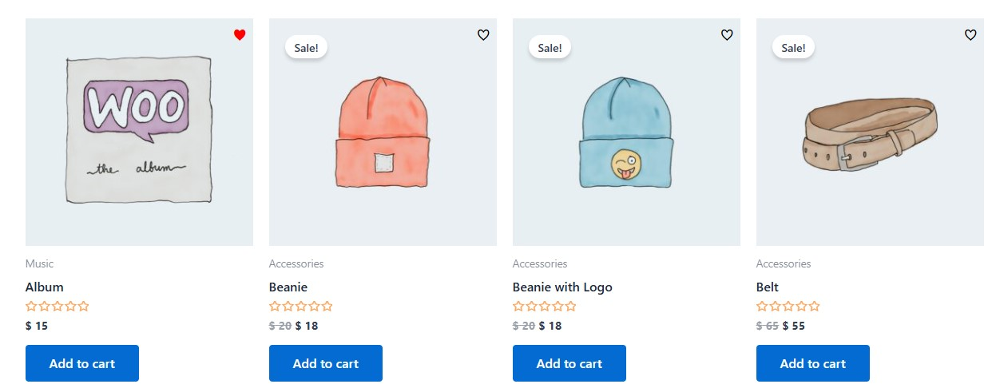
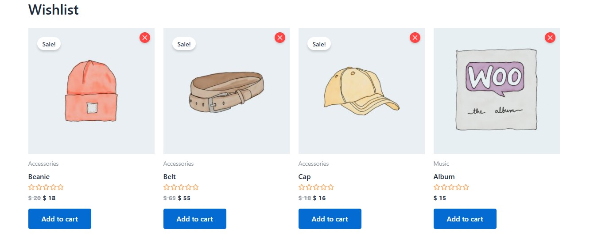

# Fast Wishlist and Bookmark Plugin

The **Fast Wishlist and Bookmark Plugin** is a WordPress plugin that enables users to bookmark posts and add Woocommerce products to a wishlist. Bookmarked items are displayed in a responsive grid via shortcodes or accessed through a REST API. This plugin supports both regular posts and Woocommerce products, with customizable settings for display and behavior.

## Overview

- **Plugin Name**: Fast Wishlist and Bookmark Plugin
- **Version**: 1.0.1
- **Author**: RJZ
- **Description**: Allows users to bookmark posts and add Woocommerce products to a wishlist, with options to display them in a responsive grid using shortcodes or retrieve them via a REST API.
- **Key Features**:
  - Bookmark posts and Woocommerce products.
  - Responsive grid display with pagination.
  - REST API endpoint for retrieving user bookmarks.
  - Customizable settings for almost everything even for overriding all CSS.
  - Supports Woocommerce integration for product wishlists.
  - AJAX-based bookmark toggling with ajax security.
  - Input Validation for security concern.

## Installation

1. Upload the plugin files to the `/wp-content/plugins/fast-wishlist-bookmark-plugin` directory.
2. Activate the plugin through the WordPress admin panel under **Plugins**.
3. Configure settings via **Settings > Fast Bookmark** in the WordPress admin dashboard.

## Wishlist for Woocommerce
### Wishlist for PLP

### Wishlist page

### Wishlist for PDP

## Notes

- Ensure Woocommerce is active for product wishlist features.
- Custom CSS is saved to `bookmark-user-custom.css` and enqueued after default styles.
- It should have write permission on plugin folder to override the css on file `bookmark-user-custom.css`.
- The plugin uses WordPress transients for caching to improve performance.
- Pagination is supported for both shortcode displays and API responses.

## Dependencies

- **WordPress**: Required for core functionality.
- **Woocommerce**: Optional, enables wishlist features for products if active.

